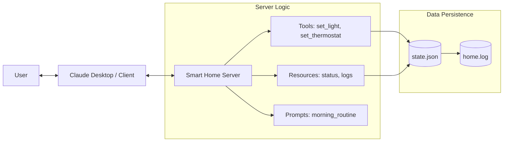

# Smart Home Manager - MCP Project

This is a production-style example of an MCP server designed to manage a smart home environment. It demonstrates how to handle state, use complex Pydantic models, and provide useful resources for an AI agent.

## 🏗️ Architecture



## 🛠️ Features

### Tools
- `list_devices`: Get the full state of the home.
- `set_light(room, power)`: Control lighting in specific rooms.
- `set_thermostat(target_temp)`: Adjust the house temperature with validation (15-30°C).

### Resources
- `home://status`: A read-only summary of the house state, perfect for quick context injection.
- `home://logs`: Access to the system audit trail.

### Prompts
- `morning_routine_prompt`: A pre-defined workflow that guides the AI through a series of morning tasks.

## 🚀 Setup & Execution

1.  **Installation**:
    Ensure you have the required dependencies:
    ```bash
    pip install mcp fastmcp
    ```

2.  **Running the Server**:
    ```bash
    python mcp_smart_home/server.py
    ```

3.  **Local Testing**:
    Use the MCP Inspector to interact with the tools:
    ```bash
    npx @modelcontextprotocol/inspector python mcp_smart_home/server.py
    ```

## 📝 Design Decisions

1.  **Statelessness vs. Persistence**: While the server logic is stateless, it persists data to a local JSON file to demonstrate how real-world integrations would handle database state.
2.  **Validation**: Used Pydantic `Field` constraints in the `set_thermostat` tool to ensure the LLM doesn't attempt to set dangerous or impossible temperatures.
3.  **Observability**: Implemented a logging system that is exposed as an MCP Resource, allowing the AI to 'see' the history of its own actions.
